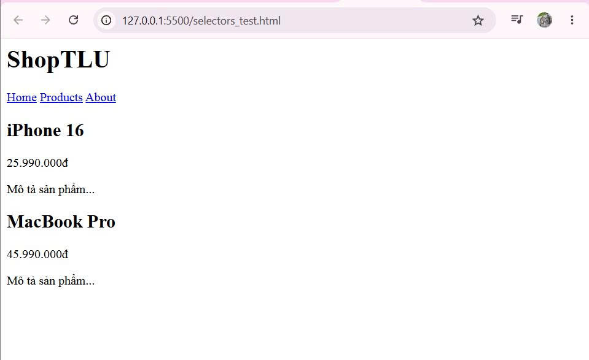
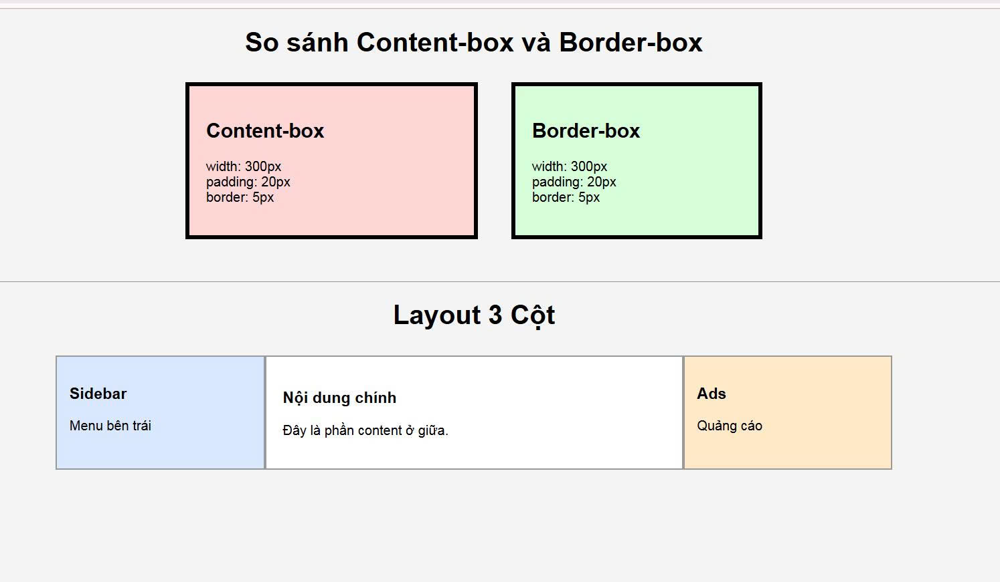

# PHẦN A — KIỂM TRA ĐỌC HIỂU (25 điểm) (answers.md - Phần A)

## Câu A1:
**3 cách nhúng CSS vào HTML**
1.  Inline CSS
- Ví dụ:

```
<p style="color: red; font-size: 16px;">Xin chào</p>
```
- Ưu điểm: Nhanh, ghi đè được hết, không cần file riêng.
- Nhược điểm: Khó bảo trì, không tái sử dụng được, trộn lẫn HTML với style.
 - Dùng khi: CSS rất nhỏ, ghi đè tạm thời, fix nhanh một element duy nhất
2. Internal CSS
- Ví dụ:
```
<head>
  <style>
    p { color: red; font-size: 16px; }
  </style>
</head>
```
- Ưu điểm: Không cần file riêng, style dùng được cho cả trang.
- Nhược điểm: Không tái sử dụng qua nhiều trang, file HTML to.
- Dùng khi: Trang đơn lẻ, email HTML, prototype nhanh.
3. External CSS
- Ví dụ:
```
<head>
  <link rel="stylesheet" href="style.css">
</head>
```
```
/* style.css */
p { color: red; font-size: 16px; }
```
- Ưu điểm: Tái sử dụng nhiều trang, dễ bảo trì, trình duyệt cache được.
- Nhược điểm: Thêm 1 HTTP request, cần quản lý file.
- Dùng khi: Hầu hết mọi dự án thực tế.

**Câu hỏi thêm:**
```
<p style="color:red;">Hello</p>
```
```
/* internal */
p {
    color: blue;
}
```
```
/* external */
p {
    color: green;
}
```

- Kết quả: Element có màu đỏ
- Thứ tự ưu tiên:
```
Inline > Internal/External
```

## Câu A2:
Dự đoán kết quả:
```
1. h1                    → <h1>ShopTLU</h1>
2. .price                → <p class="price">25.990.000đ</p>  VÀ  <p class="price">45.990.000đ</p>
3. #app header           → <header class="top-bar dark">...</header>
4. nav a:first-child     → <a href="/" class="active">Home</a>
5. .product.featured h2  → <h2>MacBook Pro</h2>
6. article > p           → CẢ 4 thẻ <p> bên trong 2 article (price + mô tả, của cả 2 article)
7. a[href="/"]           → <a href="/" class="active">Home</a>
8. .top-bar.dark h1      → <h1>ShopTLU</h1>
```


## Câu A3:
**Trường hợp 1: content-box (mặc định)**
```
width: 400px → đây là chiều rộng của CONTENT
padding: 20px (mỗi bên) → cộng thêm 20×2 = 40px
border: 5px (mỗi bên)   → cộng thêm 5×2  = 10px

Chiều rộng hiển thị  = 400 + 40 + 10 = 450px
Không gian chiếm     = 450 + 10×2 (margin) = 470px
```
**Trường hợp 2: border-box**
```
width: 400px → đây là chiều rộng gồm CONTENT + PADDING + BORDER
border: 5×2 = 10px
padding: 20×2 = 40px

Chiều rộng hiển thị  = 400px (giữ nguyên)
Content thực tế      = 400 - 40 - 10 = 350px
Không gian chiếm     = 400 + 10×2 (margin) = 420px
```
**Trường hợp 3: Margin collapse**
```
box-a: margin-bottom: 25px
box-b: margin-top:    40px

Khoảng cách thực tế = max(25, 40) = 40px
```
**Nâng cao:**
```
Khoảng cách = 40 + (-10) = 30px
```

## Câu A4:
```
Rule A:  p              → (0, 0, 1) = 1
Rule B:  .price         → (0, 1, 0) = 10
Rule C:  #main-price    → (1, 0, 0) = 100
Rule D:  p.price        → (0, 1, 1) = 11
```
- Màu hiển thị: ĐỎ — Rule C #main-price có specificity cao nhất (100).
- Nếu thêm style="color: orange": Màu CAM — inline style có specificity (1,0,0,0) = 1000, cao hơn tất cả.
- Nếu Rule A thêm !important: Màu ĐEN — !important phá vỡ cascade thông thường, đẩy rule lên tầng ưu tiên cao nhất. Tuy nhiên nếu nhiều rule cùng !important, thì specificity mới được so sánh lại trong nhóm !important. Vì chỉ Rule A có !important, nó thắng.

------
# PHẦN B — — THỰC HÀNH CODE (55 điểm) (answers.md - Phần B)
## Câu B2:


### PHẦN 1 — Content-box vs Border-box

#### Hộp 1 (content-box)

width thực tế:
300 + 20 + 20 + 5 + 5
= 350px
DevTools đo được:
350px

---

#### Hộp 2 (border-box)

width thực tế:
300px
Padding và border đã nằm bên trong width.
DevTools đo được:
300px

---

### Giải thích

- content-box:
  width chỉ tính content
- border-box:
  width bao gồm content + padding + border
Vì vậy border-box giúp layout dễ tính toán hơn.

---

## PHẦN 2 — Layout 3 cột

Nếu KHÔNG dùng border-box:
Sidebar:
250 + 15 + 15 + border
Content:
500 + 20 + 20 + border
Ads:
250 + 15 + 15 + border
=> Tổng lớn hơn 1000px
Layout sẽ bị vỡ.
---
Nếu dùng border-box:
Tổng đúng 1000px.
Layout hiển thị chuẩn.



## Câu B3:
Liệt kê 10 rules + Specificity score (Từ thấp đến cao):

`*` -> Specificity: (0,0,0) - Màu: Xám
`p` -> Specificity: (0,0,1) - Màu: Nâu
`.text` -> Specificity: (0,1,0) - Màu: Hồng
`p.text` -> Specificity: (0,1,1) - Màu: Cam
`.text.highlight` -> Specificity: (0,2,0) - Màu: Vàng
`p.text.highlight` -> Specificity: (0,2,1) - Màu: Xanh lá
`#demo` -> Specificity: (1,0,0) - Màu: Xanh lơ (Cyan)
`p#demo` -> Specificity: (1,0,1) - Màu: Xanh dương (Blue)
`#demo.text` -> Specificity: (1,1,0) - Màu: Tím
`p#demo.text.highlight` -> Specificity: (1,2,1) - Màu: Đỏ

Element cuối cùng hiển thị màu gì? Tại sao?

- Element cuối cùng hiển thị màu: GOLD
- Giải thích: Rule số 10 có specificity cao nhất: (1,2,1) → Browser ưu tiên rule này.

Thay đổi thứ tự rules trong CSS file. Kết quả có đổi không? Giải thích. Nếu thay đổi thứ tự rules:

- Nếu specificity KHÁC nhau: → Kết quả KHÔNG đổi
- Nếu specificity bằng nhau: → Rule viết SAU sẽ thắng
- Ví dụ: .text và .highlight đều có specificity (0,1,0) → Rule nào viết sau sẽ được áp dụng.

# PHẦN C — DEBUG & SUY LUẬN (20 điểm) (answers.md - Phần B)

## Câu C1:
Chiều rộng thực tế của sidebar và content (content-box!)
- Sidebar: 300 + 202 + 12 = 342 px
- Content: 660 + 302 + 12 = 722 px
Layout bị vỡ là do: Tổng Chiều rộng thực tế của sidebar và content lớn hơn chiều rộng của container chứa nó nên theo cơ chế của float content sẽ bị đẩy xuống dưới
-> Đưa ra 2 cách sửa:
- Cách 1: Dùng border-box Thêm box-sizing = border-box cho cả 2 khi đó chiều rộng của 2 phần tử sẽ là chiều rộng của border, content bị thu nhỏ cho vừa với border
- Cách 2: Không dùng border-box Phải tính toán chiều rộng của content sao cho khi cộng thêm padding và border thì bằng với chiều rộng mong muốn
  + Sidebar = 300 - 202 - 12 = 258 px
  + Content = 660 - 302 + 12 = 598 px

  